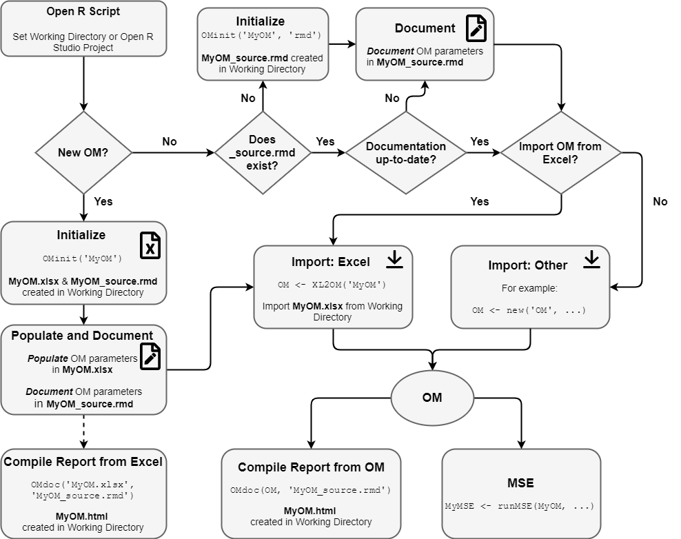
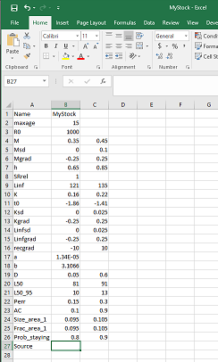
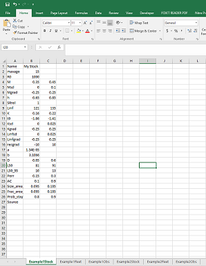
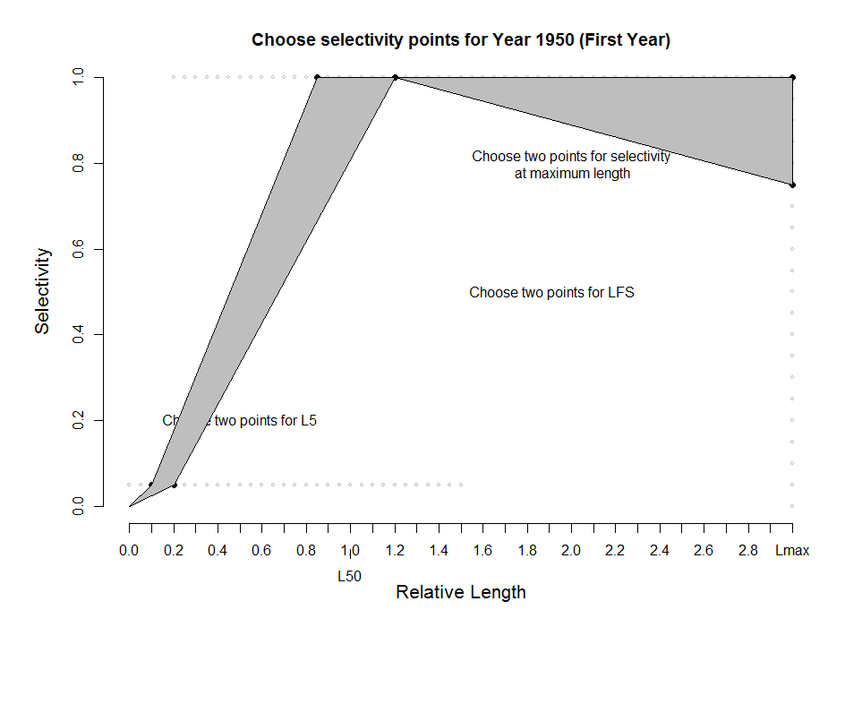

---
output:
  pdf_document: default
  html_document: default
---
# Setting up the MSE Operating Model  {#setupOM} 

```{r, message=FALSE, warning=FALSE, include=FALSE}
library(DLMtool) # only needed for building individual chapter of user guide
```

## Overview 
The Operating Model (OM) is the main component of the MSE framework.  The OM is used to simulate the population and fleet dynamics, the collection of data, and the application of a harvest control rule.  

The class *OM* is used to define the parameters for the operating model.  Remember, for help on classes you can type ```class``` followed by ? and the class name.  For example, to see the help file for the *OM* class, type the following into the R console:
```{r, eval=FALSE}
class?OM
```

## The Operating Model Object 
Objects of class *OM* contain all of the parameters required to run the MSE.  Because this is a simulation, there must be values for all parameters. 

You can see from the help file (`class?OM`) that objects of class *OM* can be constructed by using the ```new()``` function, and are built from four objects: 

1. Stock,
2. Fleet,  
3. Obs (Observation) and 
4. Imp (Implementation)

***Stock***, ***Fleet***, ***Obs*** and ***Imp*** are all classes in the DLMtool, and, as the names suggest, contain the parameters for the fish stock, the fishing fleet, the observations of the data, and the implementation of the management recommendations respectively.  

The *Stock*, *Fleet*, *Obs*, and *Imp* objects are contained within separate parameter tables, which are stitched together to form the *Operating Model* parameters.

You can look at the help files for each the these three classes for information on the **slots** for each object.  Here we will briefly go through the contents of each.

### Stock Object
First we will look at the contents of the *Stock* object. There are a number of stocks built into the DLMtool, and we will explore one of these.  Later we will look at how to develop our own *Stock* objects, or modify an existing *Stock* object.

One of the *Stock* objects that is built into the DLMtool is `Albacore`.  
If you type `Albacore` into the R console (or into your R script and click *Run*) you will see a large amount of information printed out in the R console.  


Let's take a look at the contents of the Albacore Stock object:
```{r}
slotNames(Albacore)
```

```{r, include=FALSE}
Sslots <- slotNames(Albacore)
SnSlot <- length(Sslots)
```

The output tells us that there are `r SnSlot` slots in the `Albacore` Stock object.  Each of these slots contains information relating to stock that is used in the MSE.

We can examine the information that is stored in the slots using the @ symbol. For example, the name of the species in the Stock object is:
```{r}
Albacore@Name
```
The maximum age parameter is:
```{r}
Albacore@maxage 
```

The values for the natural mortality (*M*) parameter for this stock are:
```{r}
Albacore@M
```

Note that the natural mortality parameter (*M*) has two values, while the maximum age (*maxage*) only has one value.  

The MSE in the DLMtool is a stochastic model, and almost all parameters are drawn from a distribution.  By default this distribution is assumed to be uniform, and the two values for the *M* parameter represent the lower and upper bounds of this uniform distribution.

Some parameters, such as maximum age (*maxage*), species name (*Name*), or initial recruitment (*R0*) have only a single value and are fixed in the MSE.

You can see more information on the content of the *Stock* object by using the help function:
```{r, eval=FALSE}
class?Stock
```

### Fleet Object
While the *Stock* object contains all the information relating to the fish stock that is being modeled, the *Fleet* object is populated with information relating to the fishing fleet and historical pattern of exploitation.

Like the *Stock* objects, there are a number of *Fleet* objects that are built into the DLMtool.  Here we will look at the `Generic_Fleet` object.

```{r}
slotNames(Generic_Fleet)
```

```{r, include=FALSE}
Fslots <- slotNames(Generic_Fleet)
FnSlot <- length(Fslots)
```

There are `r FnSlot` slots in the *Fleet* object. The parameters in the *Fleet* object relate to the exploitation pattern of the stock.

For example, the number of years that the stock has been exploited is specified in the `nyears` slot:
```{r}
Generic_Fleet@nyears
```

As another example, the smallest length at full selection is specified in the `LFS` slot:
```{r}
Generic_Fleet@LFS
```

Note that by default the values in the `LFS` (and the `L5` [smallest length at 5% selectivity]) slots are specified as multiples of the length of maturity (e.g., `Albacore@L50`).  This is necessary because the *Fleet* objects built into the DLMtool are all generic, in the sense that they can be used with any *Stock* object.  

You will notice that the `isRel` slot in the `Generic_Fleet` object is set to "TRUE".  This means that the selectivity parameters are relative to the length of maturity in the *Stock* object.  Absolute values for the selectivity parameters can be used, for example by specifying `LFS` and `L5` to, say, 100 - 150 and 50 - 70 respectively. The `isRel` parameter must then be set to "FALSE", so that the Operating Model knows that these selectivity values are in absolute terms, and does not multiply them by the length of maturity (strange things may happen if the model assumes that the size of first capture is 50 to 70 times greater than the size of maturity!).

Note that all the parameters in the *Fleet* object have two values, representing the minimum and maximum bounds of a uniform distribution (with some exceptions that will be discussed in more detail later).

More information on the *Fleet* object can be found by typing:
```{r, eval=FALSE}
class?Fleet
```

### Observation Object
The third component for the *Operating Model* is the *Obs* object.  This object contains all the information relating to how the fishery information is generated inside the model.

Why do we need a *Obs* table?

Although the MSE may be conditioned on real data and information about the fishery, all *data* is generated inside the model.  Because it is a simulation model and the data was generated by a computer, rather than some unobserved real world process, the *fishery data* is known perfectly.In the real world, however, all data sources and parameter estimates are subject to some observation error.  The degree of uncertainty may vary between different data types, and between different data-limited fisheries. 

The advantage of the MSE process is that the performance of a management procedure using the realistically noisy simulated data can be compared to the performance under conditions of perfect knowledge.  This comparison, which unfortunately is never possible in the real world, can reveal important information about the robustness (or sensitivity) of certain methods to variability and error in particular data types.  This knowledge can help to prioritize research to reduce uncertainty in the parameters and data sets that are most crucial to the performance of the method.  

Like the other two objects, there are a number of built-in *Obs* objects in the DLMtool.  

Let's take a look at the `Imprecise_Unbiased` object:
```{r}
slotNames(Imprecise_Unbiased)
```
```{r, include=FALSE}
Oslots <- slotNames(Imprecise_Unbiased)
OnSlot <- length(Oslots)
```

There are `r OnSlot` slots in *Obs* objects, each with information relating to the uncertainty of a data type.  

For example, the `LenMcv` slot defines the uncertainty (coefficient of variability) in the length of maturity: 

```{r}
Imprecise_Biased@LenMcv
```

This means that the assumed length of maturity that is generated by the Operating Model, and used in the simulated application of a management procedure, is not the 'true' value set in the *Stock* object, but a value sampled with a `r paste0(Imprecise_Biased@LenMcv * 100, "%")` coefficient of variation. 


More information on the *Obs* object can be found by typing:
```{r, eval=FALSE}
class?Obs
```

### Implementation Object
The final component for the *Operating Model* is the *Imp* object.  This object contains all the information relating to how the management recommendation is actually implemented in the fishery, i.e., the implementation error. The `Imp` object includes slots for the over or under catch of TAC, implementation error in total allowable effort, and variability in size limits. 

The `Imp` object is a recent addition to DLMtool and may be expanded in future developments. 

More information on the *Imp* object can be found by typing:
```{r, eval=FALSE}
class?Imp
```

### Important changes - DLMtool V4.1 and greater
DLMtool V4.1 introduced some important changes to the Operating Model object. The number of simulations (`nsim`) and the number of projection years (`proyears`) are now slots in the `OM` object, rather than arguments to `runMSE` (see [Management Strategy Evaluation]). This change was required to allow users to specify their own custom futures for parameters like *M*, growth, etc. The `OM` object also now has a new random seed slot in the operating model, which ensures that the MSE results are now exactly reproducible.

You can modify the number of simulations, the number of projection years, or the value of the random seed by modifiying the relevant slots in the `OM` object:
```{r, eval=FALSE}
myOM@nsim 
myOM@proyears
myOM@seed
```

### Important changes - DLMtool V4.5 and greater
Since DLMtool V4.5 the following slots have been added to the OM object:

- `OM@interval`
- `OM@pstar`
- `OM@maxF`
- `OM@reps`

This was done so that an OM object is completely self-contained and includes all information used in the MSE. 

## Existing Stock, Fleet, Obs, and Imp Objects
As mentioned earlier, there are several *Stock*, *Fleet*, *Obs* and *Imp* objects that are built into the DLMtool.  A list of available *Stock*, *Fleet*, *Obs*, and *Imp* objects can be found using the `avail` function.  

```{r, include=FALSE}
nstocks <- length(avail("Stock"))
nfleet <- length(avail("Fleet"))
nobs <- length(avail("Obs"))
nimp <- length(avail("Imp"))
```

For example, here we will print out a list of the `r nstocks` *Stock* objects that are built into the DLMtool:
```{r}
avail("Stock")
```

We can do the same thing for the *Fleet* objects (`avail("Fleet")`), the *Obs* objects (`avail("Obs")`), and the *Imp* objects (`avail("Imp")`).


## Recommended Method for Creating the Operating Model Object
DLMtool V4.5 introduced a standardised system for initializing, populating, documenting, and importing OM objects. 

The figure below shows our recommended workflow for importing an Operating Model (OM) into DLMtool:

```{r, echo=FALSE}

```

### Set Working Directory
We recommend creating a new directory for each OM. Each new R session should start by setting the working directory to this location. One of the easiest ways to do this is to create a new project in RStudio (File > New Project) and open this each time you revisit the analysis.

Alternatively, you can set the working directory with RStudio (Session > Set Working Directory) or directly in the R console, for example:

```{r , eval=FALSE}
setwd("C:/MSE/MyOM")
```

### Initialize a New OM 

The `OMinit` function is used to create a blank OM spreadsheet and a skeleton OM documentation file in the working directory. 
This is only required the first time a new OM is created. 

The `OMinit` function requires one argument, a name for the OM, and wil create two files in the working directory. For example `OMinit('MyOM')` will create *MyOM.xlsx* and *MyOM_source.rmd* in the working directory.

*MyOM.xlsx* is a spreadsheet with sheets corresponding to the components of an OM: *Stock*, *Fleet*, *Obs*, and *Imp*, and *OM* and *Data* sheets. The first column in each sheet is populated with the names of the slots of the respective objects (Stock, Fleet, etc) and all slots are empty (except the *OM* sheet which has default values).

The *MyOM_source.rmd* file can be opened in any text editor or RStudio, and contains a skeleton for the OM documentation.  

More details on populating both these files are provided in the [Populate and Document OM] section below.

### Create Source Documentation for Existing OM
For existing OMs without documentation, the `OMinit` function can be used to create just the source documentation file in the working directory:

```{r, eval=FALSE}
OMinit('MyOM', files=`rmd`)
```

### Using Templates
Some users may wish to build an operating model based on other pre-existing OM, Stock, Fleet, Obs, or Imp objects. 

For example, `OMinit('Albacore2', Albacore)` will result in a *Albacore2.xlsx* file being created with the *Stock* sheet populated with the values from the *Albacore* Stock object. 

Other examples:
```{r, eval=FALSE}
OMinit('StockAndFleet', Stock=Albacore, Fleet=Generic_FlatE)

OMinit('ObsAndImp', Obs=Generic_Obs, Imp=Perfect_Imp)

OMinit('BorrowOM', OtherOM)

```

### Populate and Document OM 
The OM is populated by adding values for each slot into the Excel spreadsheet.  

To assist in documenting the rationale for the OM parameters, we recommended adding a short but informative description or rationale for the OM values in the '_source.rmd' file while the OM Excel file is being populated (open the rmd file and edit with any text editor or RStudio). Once complete, the '_source.rmd' file can be compiled into a HTML report and provides a complete documentation for the OM.  

The '_source.rmd' file also contains additional information including a title for the OM report, author details, and an introduction section for additional information on the OM. 

Instructions for completing the OM documentation are provided in '_source.rmd' file.

The OM documentation file should be updated whenever values in the OM are changed. 

### Compile OM Report from Excel
Once the OM has been specified in the spreadsheet and documented in the '_source.rmd' file, it can be compiled into a OM Report using the `OMdoc` function. 

The `OMdoc` function 

```{r, eval=FALSE}
OMdoc('MyOM')
```

In most cases it is not neccessary to provide the name of the '_source.rmd' file to `OMdoc`. By default the `OMdoc` function will look for the *rmd* file in working directory. For example, if the Excel file is named *MyOM* then `OMdoc` will look for *MyOM_source.rmd*, which is default name created by  `OMinit`.

Additionally, if there is only one *xlsx* file in the working directory the name of the OM is not required, i.e., `OMdoc()`.

Depending on the OM (particularly number of simulations`(OM@nsim)` and maximum age `OM@maxage)`), this may take some time as the historical simulations are run. 

The resulting *MyOM.html* can opened in any web browser. It may also be possible to compile the OM report into a pdf (using `output="pdf_document"`) though this may require additional software.


### Import OM from Excel
The OM can be imported from the Excel file using the `XL2OM` function. 

For example, to import the example OM created in the previous section:

```{r, eval=FALSE}
OM <- XL2OM('Example_Chile_hake')
```

## Other Methods to Import OM 
Previous versions of DLMtool required the `new` command to create OM objects. This method is still available and is described in this section. 

Here we will create a Operating Model object called `myOM`, and use the `Blue_shark` *Stock* object, the `Generic_Fleet` *Fleet* object, the `Imprecise_Biased` *Observation* object, and the default `Perfect_Imp` *Imp* object:

```{r, eval=FALSE}
BlueSharkOM <- new('OM', Blue_shark, Generic_Fleet, Imprecise_Biased, Perfect_Imp)
```

If you use the `slotNames` function on the `myOM` object that was just created, you will see that it contains all of the information from the *Stock*, *Fleet*, *Obs*, and *Imp* objects.


### Compile OM Report from OM
The `OMdoc` function can be used to generate an OM report directly from an OM object and an '_source.rmd' file. In this case it is necessary to provide the name of the '_source.rmd' file to `OMdoc`. For example, here we create an OM using existing objects from DLMtool, generate the '_source.rmd' documentation skeleton (only required once), and compile the OM report:

```{r, eval=FALSE}
BlueSharkOM <- new('OM', Blue_shark, Generic_Fleet, Imprecise_Biased, Perfect_Imp) 
OMinit('BlueSharkOM', 'rmd', templates=list(Stock=Blue_shark, Fleet=Generic_Fleet, 
                                            Obs=Imprecise_Biased, Imp=Perfect_Imp))
# - Enter OM details in BlueSharkOM_source.rmd - 
OMdoc(BlueSharkOM, 'BlueSharkOM_source.rmd')
```

### Example OM Documentation
An example of the OM documentation may be useful.  

The following command creates example (already populated) *Example_Chile_hake.xlsx* and *Example_Chile_hake_source.rmd* files:
```{r eval=FALSE}
OMinit('example')
```

Each slot in the OM Excel file has been populated and a rationale provided for each slot in the documentation source file. 

The OM documentation can be compiled:
```{r Doc, eval=FALSE}
OMdoc('Example_Chile_hake')
```


## Customizing the Operating Model
We have now created or imported a *Operating Model* object and can begin the MSE.  If you wish, you can jump ahead to the [Management Strategy Evaluation] section (although you may wish to read the [Management Procedures] section first).

The remainder of this section will describe how to modify the existing *Stock*, *Fleet*, *Obs*, and *Imp* objects, as well as create new objects. 

The pre-defined *Stock*, *Fleet*, *Obs*, and *Imp* objects in DLMtool can be used for running an MSE and exploring the output.  More often, however, users of the DLMtool will be interested in performing an MSE for their own particular fishery.  

To do this, the parameters of the *Operating Model* (or more specifically the *Stock*, *Fleet*, *Obs* and *Imp* objects from which it is built) must be specified in such a way that reflects the characteristics of the fishery. 

There are a number of ways of doing this.

### Creating New Objects
One method is to create empty *Stock*, *Fleet*, *Obs*, and *Imp* objects and manually populate them.  This can be done using the `new` command:
```{r}
myStock <- new("Stock")
myFleet <- new("Fleet")
myObservation <- new("Obs")
myImp <- new("Imp")
```
This code creates new *Stock*, *Fleet*, *Obs*, and *Imp* objects that are empty and contain no information.

You can check this by looking at a slot in one of the objects, for example:
```{r}
myStock@M
```

The object can then be manually populated.  For example,
```{r}
myStock@M <- c(0.1, 0.25)
```

Here we set value of the natural mortality parameter (`M`) to range from 0.1 to 0.25.  

The MSE requires values for each parameter (or slot)  in the Operating Model object, and the three objects that were just created would have to be manually populated.

This is possible to do, but perhaps a little tedious. More importantly, it is easy to introduce errors using this method.

For example, let's try to populate the slot that contains information on the asymptotic size (`Linf`)

```{r}
myStock@Linf <- 100
```

This seemed to work okay.  However, if we try to run an MSE using this *Stock* object we will be confronted with an error.  This is because the Operating Model requires **two** values (lower and upper bounds) for the `Linf` parameter.  The DLMtool isn't smart enough (yet!) to detect this error before it is too late.  

### Importing Objects from a CSV File
There may be cases where creating a blank object is useful.  More likely, however, is that users will import an object from a file, or modify a built-in object.

This can be done by using the `new` command and specifying the location of a comma-separated-variable (CSV) file that contains the relevant information.

#### Importing a Stock Object 
If we have a CSV file named *MyStock.csv* and stored in the directory *CSVs* (located within the working directory), we can import the *Stock* object using the following code:
```{r}
myStock <- new("Stock", "CSVs/MyStock.csv")
```

The `myStock` object is now populated with the contents of the *MyStock.csv* (You may notice it is almost identical to the `Albacore` object that is in the DLMtool).

To import objects in this way, the CSV file must be set up in a specific format. The image below shows the contents of the *MyStock* CSV file.  The first column contains the names of the slots in the *Stock* object. It is important that the text in the first column of the CSV file is *exactly* the same as the names slot of the slots in the *Stock* object (you can use `slotNames` to check this).  

The second and third columns contain the values for each parameter.  Note that some parameters, such as the length-weight relationship parameters (`a` and `b`), the maximum age (`maxage`), and the initial recruitment (`R0`) only require a single value.

```{r, echo=FALSE}

```

Click [here](images/Stock.png) for a larger version of the image.

#### Importing a Fleet Object 
A *Fleet* object can be imported in a similar way:
```{r}
myFleet <- new("Fleet", "CSVs/myFleet.csv")
```

Note here again that the text in the first column must exactly match the names of the slots in the *Fleet* object.

```{r, echo=FALSE}
knitr::include_graphics("images/Fleet2.png")
```

Click [here](images/Fleet.png) for a larger version of the image.

**Note:** If the DLMtool cannot find the CSV file in the specified directory, a warning message will appear and a blank object will be created. 

#### Importing an Observation Object
To import a *Obs* object from a CSV file you follow the same procedure:
```{r}
myObs <- new("Obs", "CSVs/myObs.csv")
```

Note, however, that the *Obs* object is large (`r length(slotNames(myObs))` parameters) and it is often easiest to modify an existing *Obs* object.

We can now stitch the four objects together into a new Operating Model:
```{r}
myOM <- new("OM", myStock, myFleet, myObs, myImp)
```

By default the `new("OM")` command includes the `Perfect_Imp` Imp object.

<!-- #### Creating an Operating Model from an Excel File -->
<!-- Sometimes, especially if you are conducting MSEs on a number of species, it is easier to have all of the parameters stored in a single Excel file.  This file can be imported directly as a *Operating Model* object. -->

<!-- The *Stock*, *Fleet*, *Obs*, and *Imp* parameters are structured exactly the same as described above, but here they are in separate tabs of a single spreadsheet rather than separate CSV files. -->

<!-- The naming of the tabs for the Excel file is important.  The names of the three tabs relating to the *Stock*, *Fleet*, *Obs*, "*Imp* parameters must share a prefix followed by "Stock", "Fleet", "Obs", "Imp" respectively.  See the image below for an example. -->

<!-- ```{r, echo=FALSE} -->
<!--  -->
<!-- ``` -->

<!-- Click [here](images/XL.png) for a larger version of the image. -->

<!-- In this example we have two sets of parameters, imaginatively named "Example1" and "Example2". -->

<!-- To create *Operating Model* objects from this file we use the following command: -->
<!-- ```{r} -->
<!-- Example1OM <- OM_xl("CSVs/myXL.xlsx", "Example1") -->
<!-- Example2OM <- OM_xl("CSVs/myXL.xlsx", "Example2") -->
<!-- ``` -->

## Modifying Existing Objects
Often the simplest way to creating a custom *Operating Model* object is to modify the existing objects in the DLMtool.  

For example, suppose we wish to do a MSE for a species that we know has a similar life history to herring.  Using the existing `Herring` *Stock* object is a good place to start.

First we create a new object by copying the existing `Herring` object:
```{r}
MyStock <- Herring
```

Then we can modify the parameters so that it better suits our particular species.  For example, we may wish to modify the asymptotic size (`Linf`), the von Bertalanffy *K* parameter (`K`), and the length at maturity (`L50` and `L50_95`):
```{r}
MyStock@Linf <- c(60, 80) 
MyStock@K <- c(0.2, 0.25)
MyStock@L50 <- c(30, 40)
MyStock@L50_95 <- c(10, 15)
```
We should also change the `Name` and `Source` for our stock:
```{r}
MyStock@Name <- "Herringish"
MyStock@Source <- "None. I made this up"
```
You can continue modifying the remaining parameters as required.  

The *Fleet* and *Obs* objects can be modified in from existing objects in a similar way. First we copy existing objects, and then modify them to suit our needs:

```{r}
MyFleet <- FlatE_Dom # Dome-shaped selectivity and flat effort trajectory
MyFleet@L5 <- c(15, 20) # change the selectivity pattern
MyFleet@LFS <- c(25, 30)
MyFleet@isRel <- "FALSE" # remember to change this

MyObs <- Imprecise_Unbiased
MyObs@Mcv <- 0.15 # increase uncertainty in M
```

Here we have modified a few parameters in the *Stock*, *Fleet*, and *Obs* objects and assumed that the rest of the values in built-in objects adequately describe our fishery.  We can now create an *Operating Model* object using the same method described previously:
```{r}
MyOM <- new("OM", MyStock, MyFleet, MyObs, myImp)
```

## More on Customizing the Operating Model 
In some circumstances there may be knowledge on the changes in fishing practices over the years, and it would be good to include this information in the *Operating Model*.  

The *Operating Model* can be conditioned with respect to historical trends in the fishing mortality, and historical changes in the selectivity pattern. Remember to update and recompile the OM documentation whenever the OM is modified.

### Historical Trends in Fishing Mortality
Suppose that we know the fishery began in 1950, and fishing effort increased slowly over the next decade, was relatively stable between 1960 and 1970, then increased dramatically over the next 10 years.  We also know that, while fishing effort stayed relatively constant from 1980 to around 2000, there has been a general decline in fishing effort in recent years.

This information can be included in the *Operating Model* by using the `ChooseEffort` function.  The `ChooseEffort` function takes an existing *Fleet* object as its first argument, and allows the user to manually map out the range for the historical trend in fishing effort.  The `ChooseEffort` function then returns the updated *Fleet* object.  

A second optional argument can be used to specify the historical years. If used, this will replace the `nyears` in the *Fleet* object with the length of the `Years` vector.

```{r, eval=FALSE}
MyFleet <- ChooseEffort(MyFleet, Years=1950:2016)
```

```{r, include=FALSE}
MyFleet@EffYears <- c(1950, 1960, 1970, 1978, 1998, 2016)
MyFleet@EffLower <- c(0, 0.15, 0.15, 0.75, 0.85, 0.65)
MyFleet@EffUpper <- c(0, 0.3, 0.3, 1, 1, 0.8)
```
```{r, echo=FALSE}
knitr::include_graphics("images/EffortTraj.png")
```

If we take a look at the `MyFleet` object, we will see that three slots `EffYears`, `EffLower` and `EffUpper` have been replaced with the new values.  

Note that the trajectory that is mapped out here represents the bounds on the relative fishing mortality for each year.  In this example, the fishing mortality rate was highest (on average) between 1980 and 2000, and is currently around 65 - 80% of this maximum level.  

### Historical Trends in the Selectivity Pattern

Suppose that we may knew there had been changes in the selectivity pattern of the fishery over time. This information can be included in the *Operating Model* by using the `ChooseSelect` function.

Like the `ChooseEffort` function described above, the `ChooseSelection` function takes a *Fleet* objects as it's first argument, and returns an updated *Fleet* object.

Suppose the selectivity pattern changed in 1970 and then again in 1990, perhaps because of changes in fishing regulations.  These change points in the selectivity curve can be mapped by the following command:
```{r, eval=FALSE}
MyFleet <- ChooseSelect(MyFleet, FstYr=1950, SelYears=c(1970, 1990))
```

```{r, echo=FALSE}

```

Note that the first year (`FstYr`) must also be specified, and the selectivity pattern is mapped for this year as well.

When `ChooseSelect` is used, the `L5Lower`, `L5Upper`, `LFSLower`, `LFSUpper`, `VmaxLower`, `VmaxUpper`, and `SelYears` slots are updated in the *Fleet* object.  If these slots are populated, the values in the `L5`, `LFS`, and `Vmaxlen` slots are ignored in the operating model.  

<!--
Add methods for estimating depletion

Empirical relationships for life history parameters, etc
### Range for current depletion

### Empirical relationships for life history parameters

## More details in Imp object to be added 

-->


